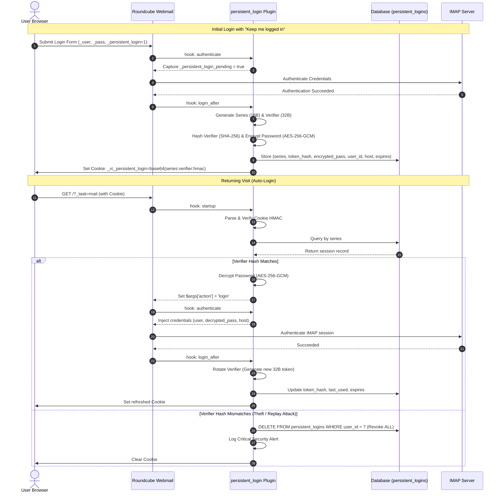

# Persistent Login ("Remember Me") Plugin for Roundcube Webmail

Enterprise-grade, cryptographically hardened **Persistent Login ("Remember Me" / "Stay Signed In")** plugin for Roundcube Webmail.

Provides seamless and secure authentication across browser restarts using the **OWASP / Paragonie Split-Token Architecture**, automatic verifier rotation, cookie theft detection, authenticated credential encryption, and trusted device management.

---

## Key Features

1. **OWASP / Paragonie Split-Token Standard**:
   - Stores a random 16-byte hex selector (`series`) and a random 32-byte hex verifier (`token`).
   - Only the **SHA-256 cryptographic hash** of the verifier is stored in the database. If the database is compromised, active session tokens cannot be derived.
2. **Automatic Verifier Rotation**:
   - On every automatic login, the verifier is regenerated, the database hash is updated, and a new cookie is issued. Old verifiers become permanently unusable immediately.
3. **Theft Detection & Instant Revocation**:
   - If an attacker intercepts and attempts to replay an old cookie (matching `series` with mismatched `verifier`), the plugin immediately detects the anomaly and **revokes all active persistent sessions for that user account**.
4. **Authenticated Credential Storage**:
   - User IMAP credentials required to establish webmail sessions are encrypted using `AES-256-GCM` with cryptographic integrity tags, keyed by Roundcube's `des_key` and an optional secondary salt.
5. **Trusted Devices Management**:
   - Adds a modern **Trusted Devices** interface under Roundcube `Settings -> Preferences -> Trusted Devices`.
   - Users can review all active computers and mobile devices (with Browser, OS, IP address, initial login, and last active timestamps), revoke individual devices with one click, or trigger "Sign Out of All Other Devices".
6. **Two-Factor Authentication Interoperability (`twofactor_auth`)**:
   - Fully compatible with `twofactor_auth`. When `persistent_login_trust_2fa` is enabled, remembered trusted devices bypass repeated 2FA prompts on auto-login, while still requiring full multi-factor verification when connecting from new devices.
7. **Skin Harmony**:
   - Supports Roundcube's official `elastic` skin, `gmail_plus` / `gmail` skins, `larry`, and `classic` skins with responsive styling and dark mode support.
8. **Multi-Database Support & Auto-Migration**:
   - Compatible with MySQL / MariaDB, PostgreSQL, and SQLite.
   - Automatically initializes its database table on startup if missing.

---

## Architecture & Data Flow

---

## Configuration Options

Configuration is located in `config.inc.php` (copied from `config.inc.php.dist`):

| Directive | Type | Default | Description |
| :--- | :---: | :---: | :--- |
| `persistent_login_lifetime` | `int` | `30` | Session lifetime in days |
| `persistent_login_cookie_name` | `string` | `'_rc_persistent_login'` | Name of persistent cookie |
| `persistent_login_cookie_secure` | `?bool` | `null` | Secure cookie flag (`null` = auto HTTPS) |
| `persistent_login_cookie_samesite` | `string` | `'Lax'` | Cookie SameSite policy (`Lax`, `Strict`, `None`) |
| `persistent_login_rotate_token` | `bool` | `true` | Rotate verifier on each auto-login |
| `persistent_login_check_ip` | `bool` | `false` | Strict IP binding (false prevents mobile drops) |
| `persistent_login_check_user_agent` | `bool` | `true` | Verify User-Agent matches session record |
| `persistent_login_max_tokens_per_user` | `int` | `10` | Max active remembered devices per user |
| `persistent_login_trust_2fa` | `bool` | `true` | Trust remembered devices to bypass 2FA challenges |
| `persistent_login_default_checked` | `bool` | `false` | Default state of checkbox on login form |
| `persistent_login_secret_key` | `string` | `''` | Optional extra HMAC pepper key |
| `persistent_login_user_can_choose_duration` | `bool` | `true` | Allow users to select duration in Preferences |
| `persistent_login_allowed_durations` | `array` | `[7, 14, 30, 60, 90]` | Duration options in user preferences |

---

## Database Schema

Database schemas are provided in the `SQL/` directory:
- `SQL/mysql.initial.sql` (MySQL / MariaDB)
- `SQL/postgres.initial.sql` (PostgreSQL)
- `SQL/sqlite.initial.sql` (SQLite)

The table is automatically verified and created if missing during runtime.

---

## License

This plugin is released under the **MIT License**.
